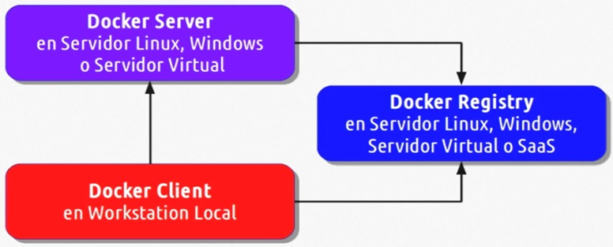

# Talk_to_you_about_Docker_and_K8S
Conversemos de Docker y Kubernetes (minikube)
## INDICE
* Docker  Registry.

## Docker Registry
### Creando una cuenta Docker-Registry.
- Existen dos formas de implementar Docker  Registry.
1.Registry en la Cloud. [https://hub.docker.com](https://hub.docker.com/)
2.Registry Localmente.
Implementando un contenedor Docker.
- Su aplicación consiste en:

+ **docker  login**
  + Conecta  el host a Docker  Registry.
+ **docker  logout**
  + Desconecta  el host a Docker  Registry.
+ **docker  search**
  + Busca una imagen publica en Docker  Registry.
+ **docker  pull**
  + Descarga una imagen del Usuario/Host en Docker  Registry.
+ **docker  push**
  + Registra una imagen del Usuario/Host en Docker  Registry.

#
### SACACI Chile

