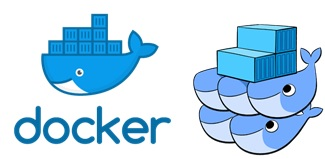
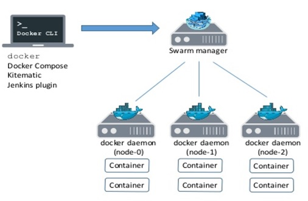
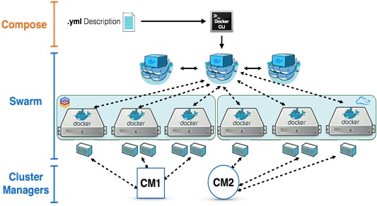

# Talk_to_you_about_Docker_and_K8S
Conversemos de Docker y Kubernetes (minikube)
## INDICE
* Docker  Swarm.

# Docker  Swarm

## Inicializando Docker  Swarm.
+ Para crear un Cluster los nodos deben tener una IP Fija, no es recomendable que sea DHCP.
```sh
$ docker  swarn  init --advertise-addr <ip_master>
```
+ Este comando regresa información para unir los nodos al cluster.
```sh
To add a worker to this  swarm, run the  following  command:
docker  swarm  join \
--token SWMTKN-1-49nj1cmql0jkz5s954yi3oex3nedyz0fb0xx14ie39trti4wxv-8vxv8rssmk743ojnwacrr2e7c <ip_master>:2377

$ docker  info
$ docker  node  ls
```
+ Unir Nodos al Cluster.
  + Logeado desde host que será nodo con Docker instalado previamente, ejecutar el siguiente comando:
```sh
$ docker  swarm  join  --token SWMTKN-1-49nj1cmql0jkz5s954yi3oex3nedyz0fb0xx14ie39trti4wxv-8vxv8rssmk743ojnwacrr2e7c <ip_master>:2377
```




### Administrando el Token.
+ Para recuperar el Token para implementar un nuevo nodo.
```sh
$ docker  swarm  join-token  worker
$ docker  info
$ docker  node  ls
```
### Administrando el Cluster (Docker  Service).
+ Una ves creados el nodo manager como los nodos del cluster, comenzamos a crear servicios en el cluster.
+ Un Service, se define como un contenedor desplegado en el cluster.
```sh
$ docker  service  ls
$ docker  service  create  httpd:latest
```
Este comando creará un contenedor en el cluster. En que nodo lo creo?
```sh
$ docker  service  ls
$ docker  service  ps <nameService>
```
### Escalemos un servicio.
```sh
$ docker  service  ls
$ docker  service  scale <nameService>=4
$ docker  service  ls
$ docker  service  ps <nameService>
```
### Disminuyamos la cantidad de Servicios.
```sh
$ docker  service  scale <nameService>=2
```
### Haciendo un deploy con docker-compose.yml.
```sh
$ docker  stack  deploy –c docker-compose.yml <nameStack>
$ docker  stack  ls
$ docker  service  ls
$ docker  service  ps <nameStack_Containe>
```

#
### SACACI Chile
