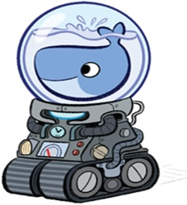
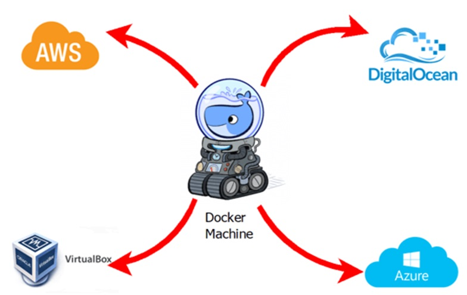

# Talk_to_you_about_Docker_and_K8S
Conversemos de Docker y Kubernetes (minikube)
## INDICE
* Docker  Machine.

# Docker  Machine

### Instalación.
```sh
$ curl -L https://github.com/docker/machine/releases/download/v0.16.1/docker-machine-`uname -s`-`uname -m` >/tmp/docker-machine
$ chmod  +x /tmp/docker-machine
$ sudo cp /tmp/docker-machine /usr/local/bin/docker-machine
$ sudo +x /usr/local/bin/docker-machine
```
### Conociendo Docker-Machine.


### Creando Docker  Machine.
```sh
$ docker-machine create --driver none --url=tcp://50.134.234.20:2376 custombox
$ docker-machine créate –d virtualbox vbx_nodo1
$ docker-machine create --driver=vmwareworkstation  vt_nodo2
$ docker-machine create --driver vmwarevsphere --vmwarevsphere-username=user --vmwarevsphere-password=SECRET vm_nodo3
$ docker-machine ls
$ docker-machine ssh vbx_nodo1
```

#
### SACACI Chile

