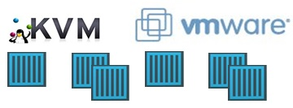
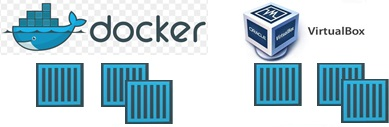
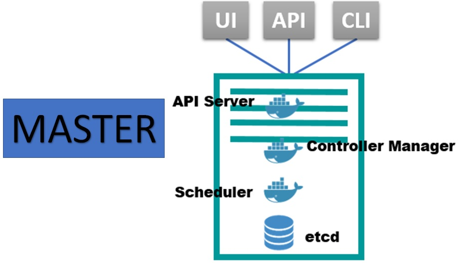
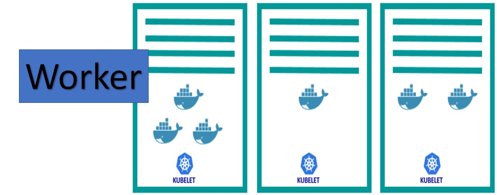
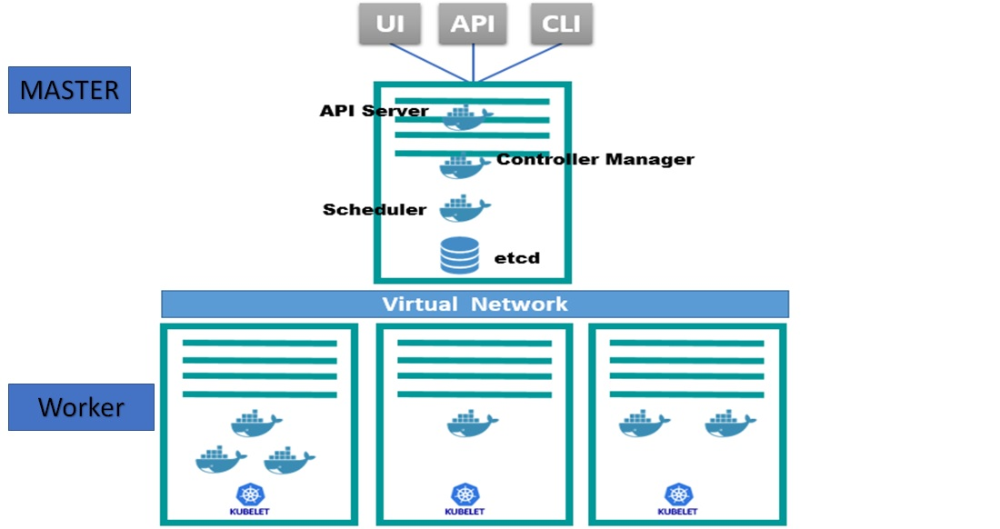
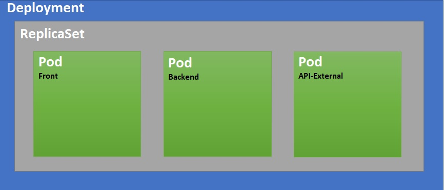
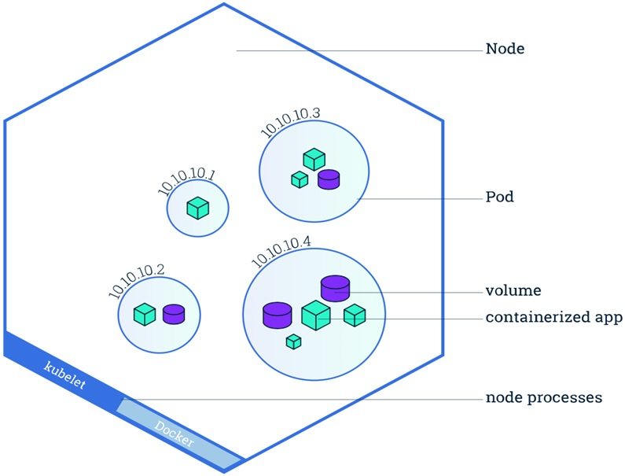

# Talk_to_you_about_Docker_and_K8S
Conversemos de Docker y Kubernetes (minikube)
## INDICE
* Kubernetes (K8S).

# KUBERNETES
### Definición Oficial 
+ Es una herramienta de Orquestación de contenedores de código abierto.
+ Desarrollado originalmente por Google.
+ Administra Contenedores acoplables o alguna tecnología que básicamente.
+ Kubernetes nos ayuda a administrar aplicaciones compuestas de cientos de contenedores o quizás de miles de contenedores.
+ Esta administración puede ser en entornos físicos, maquinas virtuales, en la nube o entornos híbridos.

### PROBLEMA-SOLUCIÓN CASO DE ESTUDIO.
#### Problema:
+ ¿Aplicaciones Monolíticas?
+ ¿La infraestructura física crece?
+ ¿Diversos Scripts propietarios para la mantención de entornos y/o ambientes?
+ ¿A pesar de la implementación de CI/CD2 aun es complejo de mantener?
+ Escenarios complejos y específicos de productos.
#### Solución:
+ Una herramienta de Orquestación de Contenedores: Kubernetes.
  + Se garantiza la Alta Disponibilidad o no Downtime.
  + Escalabilidad o Alto Rendimiento.
  + Baja tasa de respuesta.
  + Recuperación de desastres. Backup and Restore.
### ARQUITECTURA BASICA
#### ¿Como es realmente la arquitectura de Kubernetes (K8S)?
+ Para le definición de una arquitectura básica, se debe tener por lo menos 2 nodos, unos de ellos se denominará Master y el o los otros nodos Slave o Worker.
#### MASTER:
+ El nodo Master administrará el Clusters sobre los nodos, entrega instrucciones a los nodos de lo solicitado.
+ El Master posee algunos componentes:
  + Api-Server: componente que nso permite comunicarnos con K8S por intermedio de una API. Esta comunicación es a través del comando kubectl.
  + Scheduler: componente encargado informar en que nodo se debe cumplir el requerimiento solicitado. Administra los recursos del cluster.
#### Controller: 
+ Existen 4 componentes:
  + Node-Controller: es el encargado de crear una máquina o contenedor cuando falla o se cae.
  + Replicate-Controller: encargado de mantener las replicas en los contenedores. Desde ahora POD.
  + EndPoint-Controller: son servicios y Pod’s a nivel de redes.
  + Account-Controller: esta orientado a la autentificación de las API’s.
#### ETCD: 
+ Base de datos Key-Value. Utilizada para almacenar la información de K8S y utilizada por las API’s.

##### WORKER:
+ Cada nodo Worker, tendrá un agente denominado: Kubelet, es el responsable de informar y recibir ordenes desde el Master.
+ Cada Worker, tiene contenedores (POD’s) donde se alojan estas aplicaciones y un servicios denominado KubeProxy, que es el encargado de la red de los contenedores.
+ Adicionalmente, existe un componente Container-Runtime en cada nodo Worker y debe estar instalado para su correcto funcionamiento.

### CONCEPTOS BÁSICOS
#### POD: 
+ Contenedor, es la unidad más pequeña. Un Pod, puede contener 1 a n contenedores. Cada Pod, posee una IP Interna reconocida solamente en el Cluster, no es una IP publica que se pueda acceder desde el exterior u otra red. Cada ves que se crea un POD se asigna una IP nueva.
#### SERVICE: 
+ Es un servicio que disponibiliza una IP Permanente que se comunica con el Pod asociado. Si el Pod falla o se recrea por algún motivo, el Service mantendrá esta IP asignada inicialmente para su acceso. Existen 3 tipos de Service: ClusterIP, NodePort y LoadBalance.

El **Pod**, es la unidad mínima que contiene 1 o más contenedores y es unico. Para lograr que este Pod posea varias replicas debemos generar un ReplicaSet.

**ReplicaSet**, nos permite definir cuantas replicas del Pod’s queremos generar. Acá es necesario comenzar a implementar el concepto de Label’s.

Si necesitas que los cambios realizados en nuestros aplicativos sea aplicado a los contenedores de los Pod’s existentes y a su ves a las replicas de estos. Para lograr esta acción se utiliza el concepto de Deployment.

**Deployment**, es un .yaml que nos permite definir en un solo archivo manifiesto lo que deseamos implementar en K8S. Esto nos ayuda a la administración de los cambios, ya sean estos, de aplicativos, de ambientes, aumento de replicación de pod’s, etc

### Que dice Google..???

#### Dice que si quieres aprender bien Kubernetes, solo debes leer este Comic.

[https://cloud.google.com/kubernetes-engine/kubernetes-comic/](https://cloud.google.com/kubernetes-engine/kubernetes-comic/)

#
### SACACI Chile

