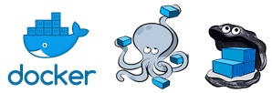
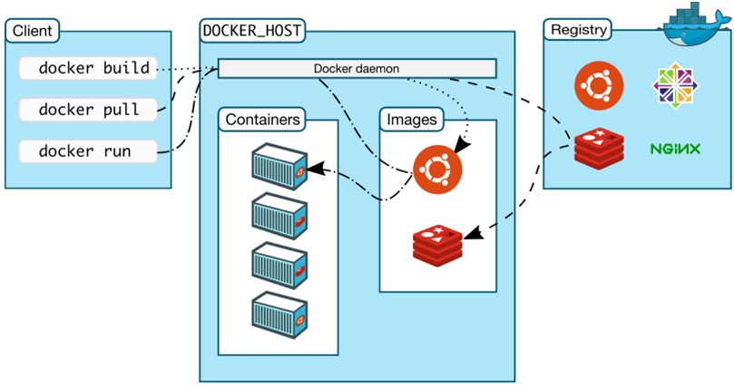
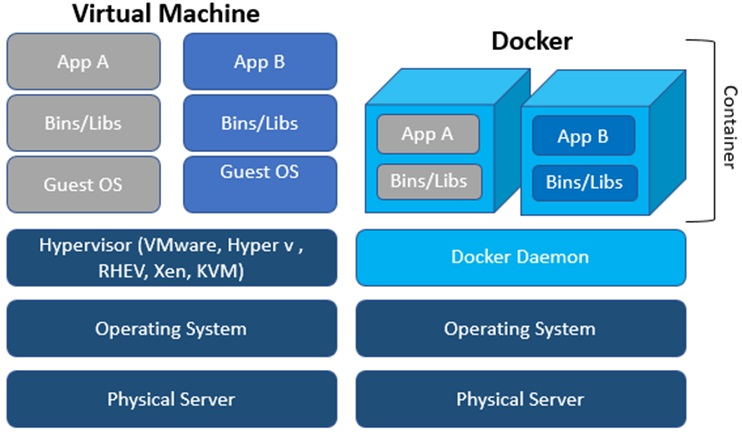
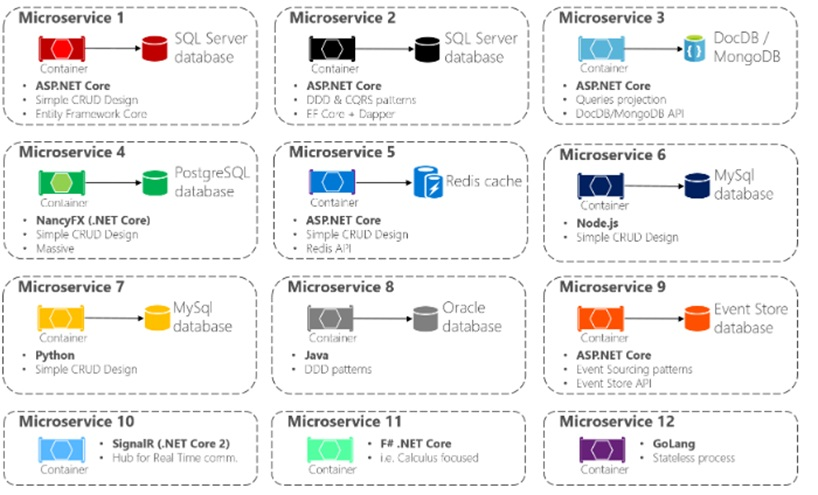
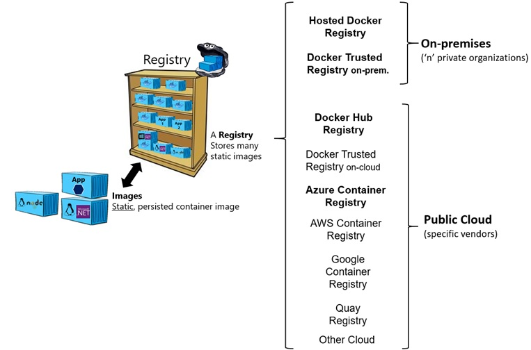
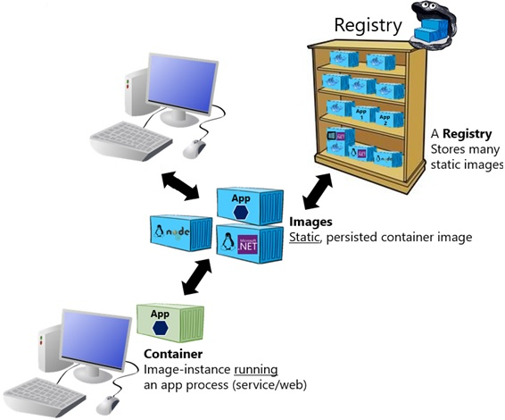
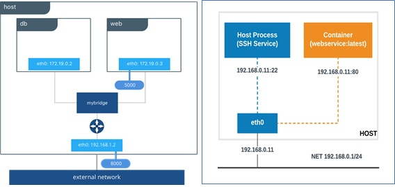
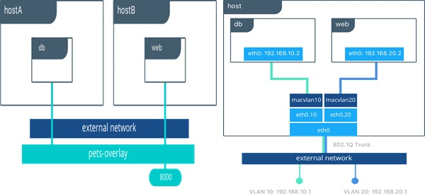
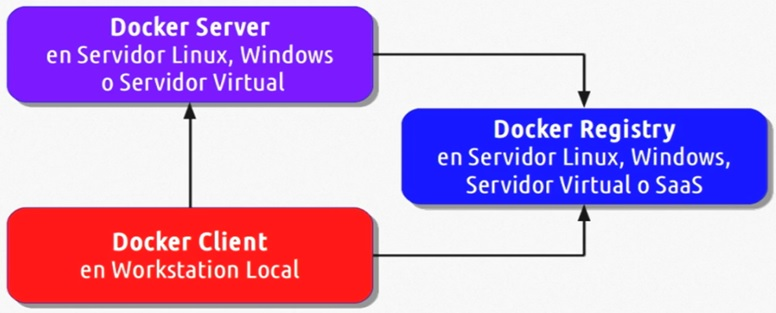

# Talk_to_you_about_Docker_and_K8S
Conversemos de Docker y Kubernetes (minikube)
## INDICE
* Docker.
* Docker  Compose.
* Docker  Registry.
* Docker  Swarm.
* Docker  Machine.
* Docker y K8S.

# DOCKER

## Instalación en Ubuntu.
Para proceder  a la instalación de Docker  necesitamos realizar los siguientes pasos:
### Validación de Soporte Virtual.
```sh
$ grep -q ^flags.*\ hypervisor /proc/cpuinfo && echo "This machine is a VM"
```
### Instalar Pre-Requisitos.
```sh
$ sudo apt-get -y install curl
$ sudo apt-get -y install conntrack
```
### Creando un APT REPO para Docker.
```sh
$ curl -fsSL https://download.docker.com/linux/debian/gpg | sudo apt-key  add -
$ sudo add-apt-repository "deb [arch=amd64] https://download.docker.com/linux/ubuntu $(lsb_release -cs) stable"
$ sudo apt-get  update
```
### Instalar Docker.
```sh
$ sudo apt-get -y install docker-ce
```
### Configurando Usuario.
```sh
$ sudo usermod -aG docker $USER
```
### Habilitar Servicio Docker.
```sh
$ sudo systemctl  start  docker
$ sudo systemctl  enable  docker
$ sudo systemctl status docker
```
### Verificando la Instalación.
```sh
$ sudo docker  version
```
Para evitar de estar escribiendo el comando sudo, crearemos un alias en el .bash_profile del usuario:
```sh
$ alias docker="sudo docker"
```
**Nota**: Este comando posiblemente te pedirá la 1era vez la clave usuario, luego no la solicitará.

## Conociendo Docker.
### La Arquitectura y Componentes de Docker

### La Tecnología Docker.


### Múltiples Patrones de Arquitectura Recomendadas para MicroServicios en Docker.


## Repositorios de Imágenes
### Para entender en que consisten las imágenes, explicaremos la Taxonomía Básica en Docker.


### Repositorio de Imágenes, debemos acceder a: [http://hub.docker.com](http://hub.docker.com/)

### Comandos para la gestión de imágenes.
```sh
$ docker  search
$ docker  pull
$ docker  images
$ docker  ps
$ docker run
$ docker stop
$ docker  rmi
```
### Ejemplos :
```sh
$ docker  search  ubuntu
$ docker  search  .net
$ docker  search http
$ docker  search apache
$ docker  search  php

$ docker  pull Ubuntu
$ docker  pull  microsoft/dotnet
$ docker  pull  httpd

$ docker  images
$ docker  image  ls
$ docker  image  ls –a
$ docker  image  ls –f

$ docker  run <name:tag>
$ docker  run httpd:latest
$ docker  run ubuntu:latest  ls
$ docker  run –it  ubuntu:latest  bash
$ docker  run –it  httpd:latest  bash
$ docker  run –d nginx:1.5.7
$ docker  run –d –name  prueba_nginx nginx:1.5.7

$ docker  stop <ID_Comntainer> 		# Se extrae de un docker  ps
$ docker  rmi <name:tag> 			# SSI no esta siendo usada
```
## Contenedores Docker.
### De igual forma que las Imágenes, existe una Taxonomía Básica para los Contenedores en Docker.


### Comandos para la gestión de imágenes.
```sh
$ docker  container
$ docker  container  logs
$ docker  container  ls
$ docker  container  exec
$ docker  container  rm
$ docker  container stop
$ docker  container  restart
$ docker  container  start
$ docker  container  commit
$ docker  save <image>
$ docker load <image>
```
### Ejemplos :
```sh
$ docker  container  logs
$ docker  container  ls
$ docker  container  ls –a

$ docker  run –d --name httpd_test1 httpd
$ docker  container  exec –it httpd_test1 bash
$ docker  container stop httpd_test1

$ docker  container  start httpd_test1
$ docker  container stop httpd_test1
$ docker  container  restart  httpd_test1

$ docker  container stop httpd_test1
$ docker  container  rm httpd_test1

$ docker  container  commit http_test1 httptest:20210331
$ docker  save httptest:20210331 | gzip > httptest_20210321.tar.gz
$ docker  save  –o  httptest_20210321.tar  httptest:20210331

$ docker load < httptest_20210321.tar.gz
$ docker load –input  httptest_20210321.tar
```
## Volúmenes (Únicos y Compartidos)
- Mecanismo para la persistencia de datos generados o modificados en un Docker  Images o Container.
- Hay dos opciones para la persistencia de datos:
### Mounted Files.
- Son fáciles de identificar, inician con la ruta absoluta que se desea compartir de tu computadora(inician con /).
- Los datos residen localmente.
- Si cambias de server, debes mover tus datos al otros server.
- Si quieres hacer un Backup debes hacerlo sin ayuda de Docker.
- No esta diseñado para compartirse entre contenedores.
- Es muy útil para entornos de desarrollo, ya que si modificamos el contenido en un server automáticamente se modifica en el contenedor y viceversa.
```sh
$ docker run -it -v /path/absoluto/mydata/:/mydata  httpd
```
### Docker  Volumes.
- Se identifican porque inician con el nombre del volumen Docker.
- Los datos residen en Docker.
- Ssi estas desplegando Docker en la nube tus datos estarán en la arquitectura en la nube.
- Si cambias de server "no importa" el volumen esta en la nube y no tendrás problemas.
- Es más recomendado para entornos de producción.
- Puedes compartir los Volumenes entre contenedores.
- No hay problemas de permisos relacionados con el SELinux.
```sh
$ docker run -it --mount type=bind,source=/path/absoluto/mydata,target=/mydata  httpd
$ docker run -it --mount type=volume,source=mydata,target=/mydata  httpd
```
### Ejemplo :
```sh
$ docker  volume  ls
$ docker  volume  create mi-volumen
$ docker  run –v mi-volumen:/var/www/html  httpd
$ docker  volumen inspect mi-volumen
$ docker  volumen prune
```
## Redes Docker.
Existen distintos tipos de redes en Docker:
- Bridge: Controlador por defecto. Crea una red puente entre la red externa y la red de contenedores.
- Host: Se utiliza para contenedores independientes en la red del host Docker.
- Overlay: Simplifica el enrutamiento entre distinta hosts que implementan Docker . Es definir Cluster  Swarm o UCP.
- Macvlan: Permite asignar una MAC a un contenedor, simulando un dispositivo físico.



- Bridge:
```sh
$ docker network create --driver bridge mi-network
$ docker  network  create --driver bridge  --subnet=10.40.0.0/16
--ip-range=10.40.5.0/24  --gateway= 10.40.5.254  mi-network
$ docker network create --driver=bridge --subnet=192.168.2.0/24 --gateway=192.168.2.254 new_subnet
```
- Host:
```sh
$ docker network create --driver host mi-host
```
### Ejemplo :
```sh
$ docker  network  ls
$ docker  run -itd --name httptest1 –h webhttp --network mi-network  httpd
$ docker  run --network=mi-network -itd --name=docker-nginx  nginx
$ docker  network  connect  docker-nginx
$ docker  network  inspect mi-network
$ docker  network  rm  new_subnet
$ docker  network  prune
```
## Conociendo DockerFile.
Los Dockerfile son los archivos que contienen las instrucciones que crean las imágenes. Deben estar guardados dentro de un build  context, es decir, un directorio. Este directorio es el que contiene todos los archivos necesarios para construir nuestra imagen, de ahí lo de build  context.
- ANOTACIONES
  + FROM: Crea una capa desde un repositorio de imágenes desde DockerHUB o localmente si existe.
  + RUN: Ejecuta un comando durante el proceso de creación del contenedor.
  + ADD / COPY: Copia un archivo del build  context y lo guarda en la imagen.
  + CMD / ENTRYPOINT: Es una instrucción para que un comando se ejecute dentro del contenedor, justo después de que el contenedor sea ejecutado.
  + ENV: Permite definir una variable de ambiente dentro contenedor.
  + WORKDIR: Define el directorio de trabajo o el actual del Contenedor.
  + EXPOSE: Permite definir el Port que utilizaremos.
  + LABEL, HEALTCHECK, VOLUME
### Interpretando Dockerfile.
```
FROM  Ubuntu 				=> es equivalente a ubuntu:latest
ENV DEBIAN_FRONTEND noninteractive
RUN  apt-get  update
RUN  apt-get –y install apache2
ADD . /var/www/html
#CMD apachectl –D FOREGROUND
ENTRYPOINT  apachectl –D FOREGROUND
ENV NAME apacheweb
```
### Ejemplo :
```sh
$ mkdir –p apache
$ cd apache
$ vi Dockerfile
FROM ubuntu:20.04
ENV DEBIAN_FRONTEND noninteractive
MAINTAINER ANS ans@anschile.cl
RUN apt-get  update
RUN apt-get –y install apache2
EXPOSE 81
CMD /usr/sbin/apache2ctl –D FOREGROUND
```
```sh
$ mkdir –p misitio
$ cd misitio
$ vi Dockerfile
FROM ubuntu:20.04
ENV DEBIAN_FRONTEND noninteractive
MAINTAINER ANS ans@anschile.cl
RUN apt-get  update
RUN apt-get -y install apache2
RUN apt-get -y install  wget
RUN apt-get -y install  unzip
RUN wget https://github.com/startbootstrap/startbootstrap-freelancer/archive/gh-pages.zip
RUN unzip gh-pages.zip
RUN cp -a startbootstrap-freelancer-gh-pages/*  /var/www/html
EXPOSE 82
CMD /usr/sbin/apache2ctl -D FOREGROUND

$ docker  run –d –p 1000:80 --name  webtest bootstrap:1.0
```
## Docker Compose.
### Instalación Docker  Compose.
```sh
$ sudo  curl -L "https://github.com/docker/compose/releases/download/1.28.4/docker-compose-$(uname -s)-$(uname -m)" -o /usr/local/bin/docker-compose
$ sudo  chmod +x /usr/local/bin/docker-compose
```
-Verificando la Instalación.
```sh
$ docker-compose --version
```
### Conociendo DockerCompose.
- Docker  Compose es una herramienta que permite simplificar el uso de Docker. A partir de archivos YAML es mas sencillo crear contendores, conectarlos, habilitar puertos, volumenes, etc.
- Con Compose puedes crear diferentes contenedores y al mismo tiempo, en cada contenedor, diferentes servicios, unirlos a un volúmen común, iniciarlos y apagarlos, etc. Es un componente fundamental para poder construir aplicaciones y microservicios.
- En vez de utilizar Docker  via una serie inmemorizable de comandos bash y scripts, Docker  Compose te permite mediante archivos YAML para poder instruir al Docker  Engine a realizar tareas, programaticamente. Y esta es la clave, la facilidad para dar una serie de instrucciones, y luego repetirlas en diferentes ambientes.
  + **version**: Corresponde a la versión del formato soportado por Docker  Compose.
  + **build**: Configuración para la creación de un contenedor. Define el Dockerfile.
    + **context**: ruta del directorio que contiene el Dockerfile.
    + **dockerfile**: Nombre del archivo alternativo Dockerfile.
    + **args**: Argumentos de compilación, son variables de entorno.
  + **labels**: Define Metadatos para la imagen en creación.
  + **network**: Define el tipo de red que tendrá el contenedor en creación.
    + **network_mode**: Define el tipo de la red.
    + **ipv4_address, ipv6_address**: Define el tipo ip para el contenedor.
  + **target**: Define el escenario o el ambiente que se define en Dockerfile.
  + **command**: Sobre Escribe el comando definido en el Dockerfile.
  + **container_name**: Define el nombre del contenedor.
  + **depends_on**: define las dependencias de los contenedores definidos en el docker-compose.yml.
  + **deploy**: Define la configuración de la implementación y ejecución de servicios. Se relaciona con Swarm.
    + **mode**: Define el método de replicación. Global, en los contenedores existentes. Replicated, crea contenedores definidos.
    + **replicas**: define el numero de replicas que se publicará el servicio.
  + **endpoint_mode**: Define el método de publicar un servicio hacia el cliente. VIP por IP o DNSRR por round-robin en DNS.
  + **resources**: Define el recurso del contenedor. (cpus, memory, etc.)
  + **env_file**: Define el archivo de las variables de ambiente. (./.env)
  + **environment**: Se define variables de ambiente hacia el contenedor a crear.
  + **expose**: Define la exposición de Port del host interno.
  + **extra_hosts**: Permite agregar hosts externo para ser reconocidos por el contenedor.
  + **healthcheck**: Permite definir la acción de chequeo de salud del contenedor.
  + **imagen**: Define la imagen que se considera para la creación del contenedor.
  + **logging**: Permite la definición del registro del servicio del contenedor.
  + **ports**: Expone la definición de los puertos (port’s) entre el contenedor y el host.
  + **restart**: Define la política de restauración del contenedor. no,:valor por defecto, alway: se restaura automáticamente.
  + **secrets**: Permite definir argumentos secretos por servicio.
  + **volumes**: Pemite montar rutas del host o volúmenes hacia el contenedor.
### Aplicando docker-compose.yml
```sh
$ docker-compose up -d
$ docker-compose  start
$ docker-compose stop
$ docker-compose pause
$ docker-compose  unpause
$ docker-compose  ps
$ docker-compose  down
```
### Creando Archivo YML.
#### Ejemplo :
```sh
$ docker  network create  -d bridge mi-network
$ vi docker-compose.yml
version: '3'
services:
  db_postgres11.5:
    container_name: ctn_db_postgres11.5
    image: postgres:11.5-alpine
    ports:
    - "5432:5432"
    environment:
      POSTGRES_USER: postgres
      POSTGRES_PASSWORD: root
    volumes:
      - “./db_data:/var/lib/postgresql/data"
    networks:
      default:
        ipv4_address: 172.18.0.36
default:
  external:
    name: mi-network
```
```sh
$ mkdir –p ./mysql57/db_data  ; cd ./mysql57
$ vi docker-compose.yml
version: '3'
services:
  srv_mysql57:
    container_name: ctn_db_mysql57
    command: ["--sql-mode=STRICT_TRANS_TABLES,NO_ZERO_IN_DATE,NO_ZERO_DATE,ERROR_FOR_DIVISION_BY_ZERO,NO_AUTO_CREATE_USER,NO_ENGINE_SUBSTITUTION"]
    image: mysql:5.7
    environment:
      - "MYSQL_ROOT_PASSWORD=root"
    ports:
      - "3306:3306"
    volumes:
      - “./db_data:/var/lib/mysql"
networks:
default:
  external:
    name: mi-network
```
## Tips  Docker/ Docker-Compose.
### Ver IP.
```sh
$ docker  inspect  ctn_ubuntu | grep IPAddress | cut –d “” –f 4
$ docker  inspect  ctn_ubuntu | jq –r ‘.[0].NetworkSetting.IPAddress’
$docker  inspect –f ‘{{.NetworkSetting.IPAddress}}’ ctn_Ubuntu
```
### Mapeo de Port.
```sh
$ docker  inspect –f ‘{{range $p, $conf:=.NetworkSettings.Ports}}{{$p}}->{{(index $conf 0).HostPort}} {{end}}’ctn_unbuntu
```
### Ver Setting Contenedor.
```sh
$docker run --rm  ctn_Ubuntu  env
```
### Eliminar Contenedores en Ejecución.
```sh
$ docker  kill $(docker  ps -q)
```
### Eliminar Contenedores Antiguos.
```sh
$ docker  ps –a | grep ‘weeks  ago’ | awk ‘{print $1}’ | xargs  docker  rm
```
### Eliminar Contenedores Detenidos o Volumenes.
```sh
$ docker  rm –v $(docker  ps –a –q –f status=exited)
$ docker  volume  rm $(docker volumen ls –q –f dangling=true)
```
## Docker Registry
### Creando una cuenta Docker-Registry.
- Existen dos formas de implementar Docker  Registry.
1.Registry en la Cloud. [https://hub.docker.com](https://hub.docker.com/)
2.Registry Localmente.
Implementando un contenedor Docker.
- Su aplicación consiste en:


+ **docker  login**
  + Conecta  el host a Docker  Registry.
+ **docker  logout**
  + Desconecta  el host a Docker  Registry.
+ **docker  search**
  + Busca una imagen publica en Docker  Registry.
+ **docker  pull**
  + Descarga una imagen del Usuario/Host en Docker  Registry.
+ **docker  push**
  + Registra una imagen del Usuario/Host en Docker  Registry.


